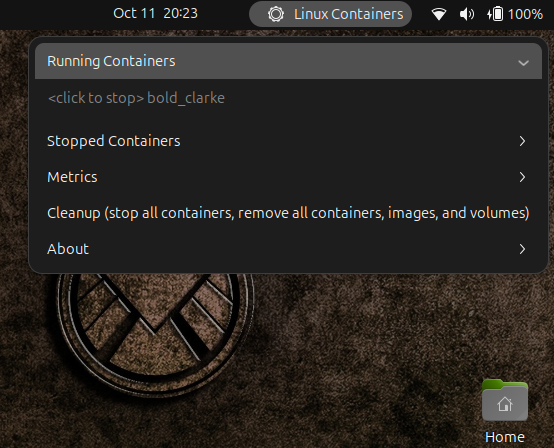
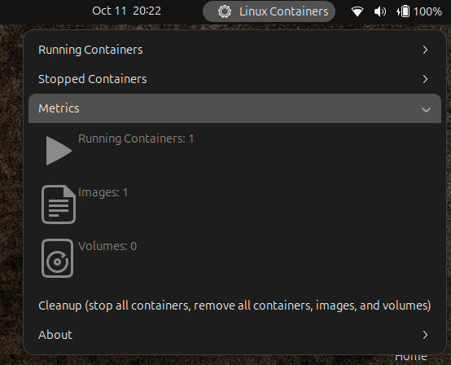

# container-tools@gnome-shell-extensions.containerize.ch

- [ ] not published

```
{
    "uuid": "container-tools@gnome-shell-extensions.containerize.ch",
    "name": "Container Tools",
    "description": "A GNOME Shell extension that provides a set of tools for managing containers.",
    "shell-version": [ "46" ],
    "url": "https://github.com/bigg01/container-tools-gnome-shell-extension"
}
```
# screenshot
)
)

## Install via Browser
You can also install this extension via the GNOME Extensions website. Visit the following URL and click on the toggle switch to install:
[GNOME Extensions Website](https://extensions.gnome.org/extension/your-extension-id/)


# enable 
```
gnome-extensions enable container-tools@gnome-shell-extensions.containerize.ch
```

## install path
`~/.local/share/gnome-shell/extensions/container-tools@gnome-shell-extensions.containerize.ch`


sudo apt-get install gtk-3-examples
gtk3-icon-browser


dbus-run-session -- gnome-shell --nested --wayland 


## know issues with podman

sudo touch /etc/containers/nodocker
sudo loginctl enable-linger $(whoami)
systemctl --user restart dbus

## run example container
```
podman run -d -p 8081:80 docker.io/kennethreitz/httpbin
```


